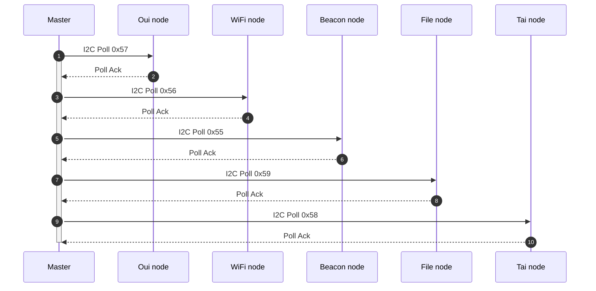
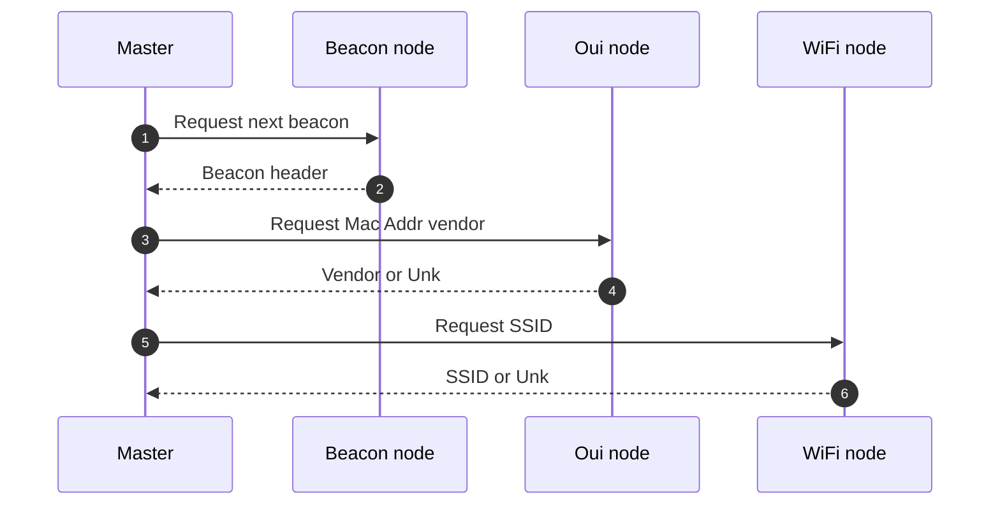

## ESP32-S3 I2C Cluster version 2 (Work in progress)

An ESP32S3 I2C cluster that captures WiFi beacon packets and outputs records that allow for a network map to be drawn (I've been using the .dot processor and Gephi for the followon processing).

## Cluster nodes
There are six nodes in the cluster:
- <b>Master node</b> The master node acts as the I2C master, requesting and reading data from the other 5 nodes. It joins a home WiFi network if present, or creats it's own and acts as an access point.
- <b>File node</b> The file node has a direct SPI connection to an SD card. It runs a simple web server that can be connected to over WiFi, records log records and can be asked to deliver the contents of a file over I2C.
- <b>Oui node</b> The Oui node resolves MAC addresses in beacon packets.
- -<b>Network scan node</b> Constantly scans the 2.4Ghz band for WiFi networks and records associated MAC addresses.
- <b>Tai node</b> The Tai node has a direct serial connection to a GPS unit. On request, tt provides date/time stamps over I2C to the Master node.
- <b>Beacon Node</b> The beacon node cycles through a list of 2.4Ghz channels collecting any beacon packets. New, not seen before mac addresses are past to the Master node.

### Background
Outside of my office window, I tend to see around 60 WiFi networks (Some hidden, some not). It's not much of a performance guide, but tests show that this cluster and the I2C bus easily keeps up with the beacon generation rate. 

Any drawn network diagrams tend to get bogged down with probes from rolling macs generated by mobile phones. I tend to just filter these out with post processing (often by Vendor OUI), but even after doing that, the inter-relationship between various WiFi networks was surprising to me.

Many of the domestic APs observed seem to offer multiple WiFi networks for roving users. These devices tend to use a rolling Mac address that is similar to the advertised network's Mac (For example, "Bt-WiFi" seems to offer a home network, a public network and one that is hidden). Where this is the case, the SSID for the roving network is associated with the fixed Mac that relates to the visible home user SSID (This is a function of the Network scanning node).

As I'm only really interested in trying to draw network maps, the Master node performs a dedupe based on the concatenation of the first three Mac addresses in any beacon packets. The dedupe "buffer" is in fact two fifo buffers. One for real macs and the other for rollers. The rolling mac buffer is roughly four times bigger, because that seems to suit the local traffic I see.

I've had a go at doing this because people tend to pour scorn on folk making mini clusters, often saying it's a waste of time. I think it's all about the use case. Using M5StampS3 modules, this cluster cost about half the price of a Raspberry Pi and it seems quite effective. Logic flow for this cluster is as follows:

### I2C Startup
Master I2C node makes connection attempts to the five other nodes. If an Ack is not received processing stops and the Master node LED flashes red. If there is a USB Serial connection made, diagnostic messages indicate which node cannot be contacted.

If all nodes appear to be live, the master node processing then waits for a button press before activation. During this "dormant" period, two of the nodes start processing:
* <b>WiFi node</b>: 
Starts to scan for WiFi networks. The details of each new network are stored in a structure, indexed by BSSID, with a string value for the SSID. The structures are held in an array that holds up to 200 records. If this count is exceeded no further records are added. An I2C ISR access this buffer to answer SSID lookups requested by the master, so there isn't the processing time available to make the array a link list.

* <b>Beacon node</b>:
Starts to cycle through WiFi channels, storing any management beacon packets it can see. An I2C ISR sits waiting for the master to request the next beacon. Up to 255 beacons are stored in a FIFO buffer and the last but one beacon packet is returned. 

* <b>Oui node</b>
The Oui node has a pre-loaded array of Vendor strings indexed by the four byte OUI value extracted from a Mac. This array can be updated with fresh values by using Netcat on port 180. The node always listens to this port for a connection and updates can take place at any stage. 

### Running

1.  The master requests the next beacon packet.
2.  The beacon node returns the last available packet
3. If the ADDR1 field in the packet is not a broadcast MAC, the master extracts the four most significant bytes of the Mac address and sends it to the Oui node.
4.  The Oui node looks these four bytes up in it's OUI table and if found, returns the Vendor details or the string OUI_Unk.
5. The Master then sends the ADDR1 mac address to the WiFi node.
6. The WiFi node looks the Mac address up to see if it's seen an association with an SSID. If found, an SSID string is returned or the value NET_Unk. Macs can be short (Middle four bytes) or long (All 6 bytes). This helps with the resolution of public access points where a rolling mac address is associated with a publically available SSID (Such as Virgin_Media, BT-WiFi Etc). In this instance, the real home SSID is returned.

### Data output format

The master node generates a single CSV type record for each unique beacon packet it sees (In this instance, unique means the concatenation of the first three Mac addresses extracted from the beacon packet have not been seen before). The output format is as follows:
+ <b>Addr</b>1 (Six 2-digit hex numbers)

+ <b>Addr2</b> (Six 2-digit hex numbers)

+ <b>Addr3</b> (Six 2-digit hex numbers) 

+ <b>Addr1 vendor</b> (Vendor string or "Roll" for rolling mac, "Bcast" for a broadcast)

+ <b>Addr1 SSID</b> (SSID string or "NET_Unk")

+ <b>Addr1 OUI</b> (Vendor string or "OUI_Unk")

+ <b>Addr2 vendor</b> (Vendor string or "Roll" for rolling mac, "Bcast" for a broadcast)

+ <b>Addr2 SSID</b> (SSID string or "NET_Unk")

+ <b>Addr2 OUI</b> (Vendor string or "OUI_Unk")

+ <b>Addr3 vendor</b> (Empty if ADDR2=ADDR3, else Vendor string or "Roll" for rolling mac, "Bcast" for a broadcast)

+ <b>Addr3 SSID</b> (Empty if ADDR2=ADDR3, else SSID string or "NET_Unk")

+ <b>Addr3 OUI</b> (Empty if ADDR2=ADDR3 else endor string or "OUI_Unk")

* <b>ADDR2 Channel number</b> (Integer)

+ <b>Beacon seq #</b> (Integer. Rolling buffer position)

